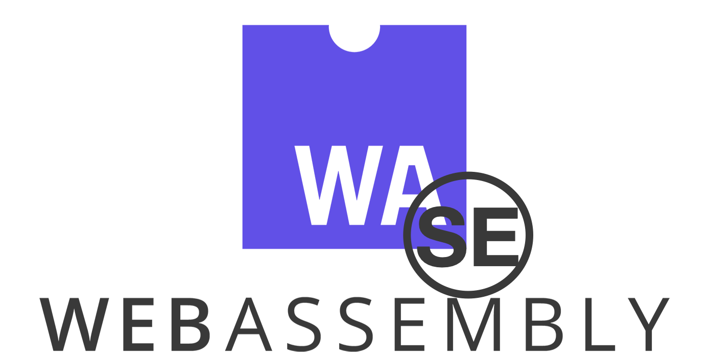

# Wasm-SE

WebAssembly (Wasm), as a low-level language, has several advantages. Moreover, Wasm can be translated from other mainstream programming languages, e.g., C, C++, Go, Rust and so on.

In this project, we have implemented a **symbolic execution engine** for Wasm files. Our goal is to build a set of toolchain, which can take source code file (written in other programming languages) as input, symbolically execute it, and generate the path constraints for further analysis (e.g., vulnerability detection).

Currently, we have supported some of standard C library functions, and we are going to support Go in the following stage.

|          |     C      |     Go     | EWasm | EOSIO | Rust  |
| :------: | :--------: | :--------: | :---: | :---: | :---: |
| Progress | Working on | Working on | TODO  | Done  | TODO  |

##  Prerequisites 
To run the samples (some simple Wasm files compiled from C), you have to install some python libraries as follows:

```shell
python3 -m pip install -r requirements.txt
```

You can test if all of them are installed successfully by:

```shell
python3 test.py
```

This command will traverse the `c2wasm_samples` folder and extract the Wasm files. If all of them can be symbolically executed without any exceptions, the success info would shown in your terminal **after several minutes**.

## Toolchain

To analyze the files written in other programming languages, you have to generate the corresponding Wasm file in your local environment. In this section, we would briefly give the instruction about how to compile C / Go file into Wasm.

### C -> Wasm

#### One-Shot Solution

Write your own `[file_name].c` file in the `c2wasm_samples` folder. Then, `cd` to the folder, and run:

```shell
./gen.sh [file_name]
```

The corresponding files would be generated.

#### Manual Generation

To generate Wasm file from C, we recommend the tool: [Emscripten](https://emscripten.org/index.html). You can follow its [official instruction](https://emscripten.org/docs/getting_started/downloads.html) to install it in your local environment. To verify if emcc is installed successfully, run `emcc --check` in your terminal to see if any error happens.

After emcc is installed, use the command:
```shell
emcc [file_name].c -g3 -s WASM=1 -o [file_name].html
```

Here, `-g3` means the generated Wasm file would keep the debug information, which would be used in the following stage.
The above command would generate three files: `[file_name].html`, `[file_name].js` and `[file_name].wasm`. The first two files provide the hosting environment for the Wasm file. Thus, we can only focus on the `[file_name].wasm`, in which all the logic in C is transferred to Wasm instructions.

Moreover, our tool requires a *WebAssembly Text* file with the same name of the Wasm file. You have to install the official tool [wasm2wat](https://github.com/WebAssembly/wabt) and use the command:

```shell
wasm2wat [file_name].wasm > [file_name].wat
```

To run the generated Wasm file, please refer to [this part](#analyze-specific-functions).

### Go -> Wasm

There are two ways to translate Go code into Wasm code: original Go and TinyGo. **We strongly recommend use the latter one, i.e., TinyGo.**

#### Original Go
To compile Go code to Wasm file, you have to firstly make sure the Go environment is properly installed on your device.
You can test it in your terminal by:
```shell
go version
```

Then, you can use the following command to compile a `[file_name].go` into `[file_name].wasm`, and convert it into a Wat file.
```shell
GOOS=js GOARCH=wasm go build -o [file_name].wasm
wasm2wat [file_name].wasm -o [file_name].wat
```

Note that the Wat file is larger than 60M, because it contains all the necessary functions that are used to interact with the hosting environment (JavaScript here as we assigned).
The `main` function in Go file is named as `main.main` in the Wat file.

#### TinyGo
[TinyGo](https://tinygo.org/getting-started/install/) requires Go version greater than 1.15. You should install it and check it by:
```shell
tinygo
```

If it is successfully installed on your computer, you can use command below to generate the corresponding Wasm and Wat files.
```shell
tinygo build -o tinygo_main.wasm -target wasm ./main.go
wasm2wat tinygo_main.wasm -o tinygo_main.wat
```

Note that, the entry of compiled Wasm is `_start`, thus the command to run the symbolic execution engine is (maybe you should change the python version on your demand):
```shell
python3.6 octopus_wasm -f './go_samples.nosync/hello_world/tinygo_main.wasm' -s --onlyfunc _start --need_mapper --concrete_globals --source_type go
```

## Analyze

In this section, we would show how to use Wasm-SE to analyze the generated Wasm file.

### Analyze Specific Function(s)

To specify which functions would be analyzed, i.e., as the entry point during the symbolic execution, we should use the following command:

```shell
python3 octopus_wasm -f [path_to_file].wasm -s --onlyfunc [entry_func] --need_mapper -v
```

Here, in the `[entry_func]`, users are allowed to specify the entry functions. For Wasm file compiled from C, we typically set this field as `main`.
Moreover, `--need-mapper` is compulsory, because it can make a mapping between Wasm function indice and standard C library functions' name.
Also, you can use `-v` to output each Wasm instruction's behavior.

### Enable Vulnerability Detector

The goal of Wasm-SE is to automatically identify vulnerabilities in scanned files. Currently, we are working on the implementation of detectors, and some of them have been achieved.
The details are shown in below:

| Vulnerability Type | Integer  Overflow / Underflow | Div Zero | Buffer Overflow |
| :----------------: | :---------------------------: | :------: | :-------------: |
|    **Progress**    |          Working on           |   Done   |      TODO       |

Users can input `--overflow` or `--divzero` to enable the corresponding detectors.

----

**NOTE: BELOW IS DEPRECATED**

# Compile WASM from C

## Tools

1. [customized clang](https://github.com/bytecodealliance/wasmtime/blob/main/docs/WASI-tutorial.md#from-c): this is a c2wasm compiler provided by the [WASI](https://wasi.dev/) team, which will compile c to wasm code runnable in [wasmtime](https://wasmtime.dev/) or [wasmer](https://wasmer.io/), both of which are WASM runtime (without browser required). However, some APIs in c (like `syscall()`) are not supported.
2. [Emscripten](https://emscripten.org/): this is a complete compiler toolchain to WebAssembly. It can compile c to wasm code running in browser (with a `-o xx.html` target) or in the aforementioned WASM runtime (with a `-o xx.wasm` target).

# Generate CFG

```bash
python3.6 octopus_wasm -g -f /path/to/xx.wasm --onlyfunc main
```

Example:

```
python3.6 octopus_wasm -g -f c2wasm_samples/simple_condition_g3.wasm --onlyfunc main
```

Results:

Shown as `cfg/simple_conditon.cfg.gv.pdf`.

Note:

- For wasm code compiled from c, it is recommended to use Emscripten with a `-g3` option provided. 
- Make sure the function name is correctly exported when using `--onlyfunc` option. (use [wasm2wat](https://github.com/WebAssembly/wabt) to check)